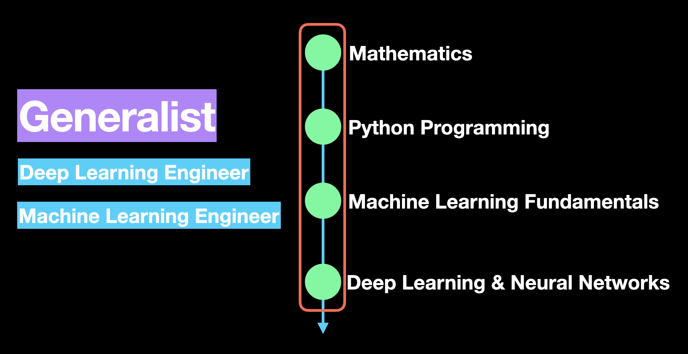

# Learn AI
List of youtube videos and resources to learn AI for FREE. The main intention of this repo is to keep the content listed here completely free so that anyone with time and motivation can go and learn. 

Let the (Machine) Learning begin!

## Road Map
The roadmap is divided into a generalist and specialist contents. The generalist contents cover the fundamentals that are essential for getting started with Machine Learning. The contents caters for varied background of people learning AI. For example, if you hold a degree in Mathematics, then you can safely ignore the mathematics content and focus on programming to strengthen your programming skills. On the other hand, if you have worked as a software engineer for a few years, you may choose to spend more time with Mathematics content to strengthen the Maths concepts.

## Generalist
Any generalist in AI should be fluent in Mathematics, Programming and Fundamentals of Machine Learning.

### Mathematics 
* Linear Algebra by Prof. Gilbert Strang 
* Essence of linear algebra by 3Blue1Brown 
* Introduction to Probability by Prof. John Tsitsiklis and Prof. Patrick Jaillet  
* Khan academy course on Probability and Statistics 
* Khan academy course on Multivariable  courses 
* Khan Academy course on Differential Equations 
* Stanford Course on Convex Optimization 

### Python Programming
* Python for beginners 
* Khan Academy - Intro to Python Fundamentals 
* Intermediate Python Programming Course from FreeCodeCamp by Patrick 
* (Practice) Leet Code 

### Machine Learning
* Machine Learning Course for Beginners by FreeCodeCamp 
* Machine Learning - A gentle Introduction 
* Complete Machine Learning in 6 hours 

### Deep Learning and Neural Networks
To learn Deep Learning, its better to choose between the PyTorch and TensorFlow frameworks. If you are confused, you may try out both to begin with and then choose one based on whichever feels good and convenient to you. 
I personally chose PyTorch when it was at its beta version and loved it ever since. 
* PyTorch Route:
  * Deep Learning Fundamentals from Lightning AI (Units 1 to 4) 
  * Deep Learning With PyTorch by Patrick Loeber 
* Tensorflow + Keras Route:
  * Deep Learning with TF 2.0, Keras and Python 

## Specialist
By learning the above you will be more of a generatlist in Machine Learning. However, these days experts are preferred over generalist, mainly due to the depths each area of the field has reached. For example, a company providing text summarization service would prefer someone who has worked in NLP (with experience in LLMs as added advantage) rather than someone who has worked in speech recognition. 

For this reason, it is better to choose a specialization of your choice once you have covered the fundamental courses. In the below section, I have grouped the specialization into general data science, NLP, Computer Vision and covered what you need to learn technically to be find a job in each of the specialist roles. I have also curated learning resources available under each specialisation so that you can jump start your specialization straightaway. 

If you are struggling to choose between NLP and Computer Vision, there is are crash courses on both which can help you decide:
* Data Science Crashcourse 
* NLP Crashcourse 
* Computer Vision Crashcourse 

### Data Science Expert
Data scientists mostly work with time series and tabular data. For this reason, its best to learn packages like NumPy, SciPy, ScikitLearn which have impementations of most mathematical operations data scientists use on a day to day basis. They also plot and visualize data quite a lot and so its important to strengthen your Matplotlib. 
* NumPy crash course by NeuralNine 
* scikitLearn crash course
* Complete Pandas for Data Science 
* Pandas for Data Science in 20 Minutes 
* Matplotlib crash course 
* Python Machine Learning Tutorial 

### NLP Expert 
Below are some resources that will give you knowledge on NLP fundamentals before jumping into the sea of Large Language Models (LLMs) and Transformers

* Stanford NLP Course 
* RNN implementation with NumPy 
* NLP with Spacy and Python 
* NLTK with Python for NLP 
* Deep Learning With Tensorflow 2.0, Keras and Python 

### Computer Vision Expert
If you fancy vision over language, then you will have to learn about convolutional neural networks and computer vision in general before jumping into Transformers and Generative models such as Diffusion Models. Below are some resources to learn Computer Vision
* Stanford Vision Course 
* Computer Vision fundameltals by Berkeley  
* Modern Computer Vision by Berkley 
* DeepLearning AI course on CNNs 
* Convolutional Neural Networks by Coding Lane 

### Transformers
Whichever specialization you chose, you cannot escape learning about Transformers as all the latest large models such as ChatGPT and Llama are based on the Transformers architecture. Below are some useful resource for learning about trainsformers
* The illustrated guide to Transformers 
* Transformers from Scratch  

